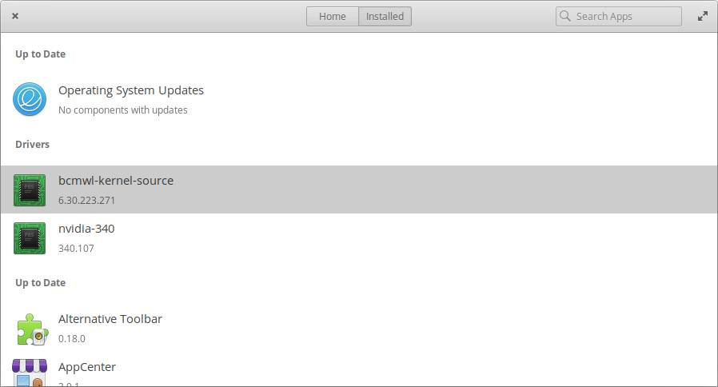

# Elementary OS on HP Pavilion dv7

I have an old HP Pavilion dv7 laptop computer, which stood out of use on the shelf. I replaced an old HDD with SSD to make it a bit faster. To bring some life into this comp now, I had to decide which OS to install on it.

I'm using mostly macOS or iOS devices, so Windows wasnt an attractive alternative for me. Linux, but which one? I like Ubuntu, but not huge fan of it's dark GUI. After some digging I found Elementary OS. I decided to try. The latest version at this moment is 5.0 Juno.


Everything went almost smoothly, but I got few issues with hardware and usability etc. Luckily I was able to solve those issues, but it took a while to google. So I decided to create this documentation to store my knowledge, which might become handy for others too.

## Hardware
There are plenty of various HP Pavilion dv7 models available. To avoid any confusion, I give all details about my comp, so you can check, does hardware related guides make any sense for you.
```
lspci -nn
00:00.0 Host bridge [0600]: Intel Corporation Mobile 4 Series Chipset Memory Controller Hub [8086:2a40] (rev 07)
00:01.0 PCI bridge [0604]: Intel Corporation Mobile 4 Series Chipset PCI Express Graphics Port [8086:2a41] (rev 07)
00:1a.0 USB controller [0c03]: Intel Corporation 82801I (ICH9 Family) USB UHCI Controller #4 [8086:2937] (rev 03)
00:1a.1 USB controller [0c03]: Intel Corporation 82801I (ICH9 Family) USB UHCI Controller #5 [8086:2938] (rev 03)
00:1a.7 USB controller [0c03]: Intel Corporation 82801I (ICH9 Family) USB2 EHCI Controller #2 [8086:293c] (rev 03)
00:1b.0 Audio device [0403]: Intel Corporation 82801I (ICH9 Family) HD Audio Controller [8086:293e] (rev 03)
00:1c.0 PCI bridge [0604]: Intel Corporation 82801I (ICH9 Family) PCI Express Port 1 [8086:2940] (rev 03)
00:1c.1 PCI bridge [0604]: Intel Corporation 82801I (ICH9 Family) PCI Express Port 2 [8086:2942] (rev 03)
00:1c.2 PCI bridge [0604]: Intel Corporation 82801I (ICH9 Family) PCI Express Port 3 [8086:2944] (rev 03)
00:1c.3 PCI bridge [0604]: Intel Corporation 82801I (ICH9 Family) PCI Express Port 4 [8086:2946] (rev 03)
00:1c.4 PCI bridge [0604]: Intel Corporation 82801I (ICH9 Family) PCI Express Port 5 [8086:2948] (rev 03)
00:1c.5 PCI bridge [0604]: Intel Corporation 82801I (ICH9 Family) PCI Express Port 6 [8086:294a] (rev 03)
00:1d.0 USB controller [0c03]: Intel Corporation 82801I (ICH9 Family) USB UHCI Controller #1 [8086:2934] (rev 03)
00:1d.1 USB controller [0c03]: Intel Corporation 82801I (ICH9 Family) USB UHCI Controller #2 [8086:2935] (rev 03)
00:1d.2 USB controller [0c03]: Intel Corporation 82801I (ICH9 Family) USB UHCI Controller #3 [8086:2936] (rev 03)
00:1d.3 USB controller [0c03]: Intel Corporation 82801I (ICH9 Family) USB UHCI Controller #6 [8086:2939] (rev 03)
00:1d.7 USB controller [0c03]: Intel Corporation 82801I (ICH9 Family) USB2 EHCI Controller #1 [8086:293a] (rev 03)
00:1e.0 PCI bridge [0604]: Intel Corporation 82801 Mobile PCI Bridge [8086:2448] (rev 93)
00:1f.0 ISA bridge [0601]: Intel Corporation ICH9M LPC Interface Controller [8086:2919] (rev 03)
00:1f.2 SATA controller [0106]: Intel Corporation 82801IBM/IEM (ICH9M/ICH9M-E) 4 port SATA Controller [AHCI mode] [8086:2929] (rev 03)
00:1f.3 SMBus [0c05]: Intel Corporation 82801I (ICH9 Family) SMBus Controller [8086:2930] (rev 03)
01:00.0 VGA compatible controller [0300]: NVIDIA Corporation G96M [GeForce 9600M GT] [10de:0649] (rev a1)
02:00.0 Network controller [0280]: Broadcom Limited BCM4322 802.11a/b/g/n Wireless LAN Controller [14e4:432b] (rev 01)
05:00.0 Ethernet controller [0200]: Realtek Semiconductor Co., Ltd. RTL8111/8168/8411 PCI Express Gigabit Ethernet Controller [10ec:8168] (rev 02)
06:00.0 FireWire (IEEE 1394) [0c00]: JMicron Technology Corp. IEEE 1394 Host Controller [197b:2380]
06:00.1 System peripheral [0880]: JMicron Technology Corp. SD/MMC Host Controller [197b:2382]
06:00.2 SD Host controller [0805]: JMicron Technology Corp. Standard SD Host Controller [197b:2381]
06:00.3 System peripheral [0880]: JMicron Technology Corp. MS Host Controller [197b:2383]
```

Internal USB devixes
```
lsusb
Bus 002 Device 002: ID 090c:c371 Silicon Motion, Inc. - Taiwan (formerly Feiya Technology Corp.)
Bus 002 Device 001: ID 1d6b:0002 Linux Foundation 2.0 root hub
Bus 008 Device 001: ID 1d6b:0001 Linux Foundation 1.1 root hub
Bus 007 Device 001: ID 1d6b:0001 Linux Foundation 1.1 root hub
Bus 006 Device 001: ID 1d6b:0001 Linux Foundation 1.1 root hub
Bus 005 Device 001: ID 1d6b:0001 Linux Foundation 1.1 root hub
Bus 001 Device 004: ID 07ca:a309 AVerMedia Technologies, Inc. AVerTV DVB-T (A309)
Bus 001 Device 001: ID 1d6b:0002 Linux Foundation 2.0 root hub
Bus 004 Device 001: ID 1d6b:0001 Linux Foundation 1.1 root hub
Bus 003 Device 003: ID 138a:0001 Validity Sensors, Inc. VFS101 Fingerprint Reader
Bus 003 Device 004: ID 03f0:171d Hewlett-Packard Bluetooth 2.0 Interface [Broadcom BCM2045]
Bus 003 Device 001: ID 1d6b:0001 Linux Foundation 1.1 root hub
```
Most of hardware works out of box. Few parts required some special attention:

* Wifi - Broadcom BCM4322
* Bluetooth - Broadcom BCM4322
* GPU - GeForce 9600M GT
* TV Card -  AVerMedia DVB-T (Internal USB)

## Installing Elementary OS 5.0 Juno

Installation procedure is quite simple and I'm not going to explain it, there are plenty of guides with screenshots available.

Live CD for installing OS can be odwnloaded from [Elementary.io homepage](https://elementary.io/).

The fist challenge was to create an bootable USB disk from downloaded ISO image. But thanx to the **[Etcher app](https://www.balena.io/etcher/)** it was super simple. Etcher helps to flash OS images to SD cards & USB drives, safely and easily. Etcher is available for macOS, Window and Linux.

After few minutes my HP was booted into Elementary OS Live CD and I had to follow the on-screen instructions, which guided me through the rest of the process. I recommend to connect comp to wired LAN to update all components during the installation.

## Post-Installation
The post-installation is where the real fun begins.

### Installation of Broadcom BCM4322 Wifi drivers

There are several various guides how to install drivers for Broadcom BCM4322 [14e4:432b] wifi adapter. But when installing Elementary OS 5.0 Juno, you can skip all these now! Elementary's AppCenter provides easy way to install those drivers.



Open **AppCenter** and go to **Installed** tab.
On Installed tab should appear below the **Drivers** section item **bcmwl-kernel-source**. Just click on button at the rigt side to install it.

If for some reason you don't see these drivers on AppCenter, you can install these via **Terminal**.
```
sudo apt install bcmwl-kernel-source
```
On some cases after installation of drivers, devices doesn't become available. So we have to run these commands in **Terminal**.
```
rfkill list
```
For all devices you want to use, should appear these status lines:
```
	Soft blocked: no
	Hard blocked: no
```
To enable devices just run these command in Terminal
```
rfkill unblock wifi
rfkill unblock bluetooth
```
You can change settings for these devices from **System Settings** app now.

### Installation of NVIDIA GeForce 9600M GT drivers
Without proper NVIDIA drivers graphics will be sluggish and slow. Some apps event couldn't run as they require hardware acceleration.
Luckily **NVIDIA binary driver** can be installed from **AppCenter** too from **Installed** tab **Drivers** section, whre it appears under name nvidia-nnn, where nnn is driver ID, for example on my case **nvidia-340**. For G8x, G9x and GT2xx GPUs is **nvidia-340**, but for NV4x and G7x GPUs is **nvidia-304**.


Just install it and reboot.

If for some reason drivers are nor listed on AppCenter, these can be installed manually from Terminal:
```
sudo apt install software-properties-common
sudo add-apt-repository ppa:graphics-drivers/ppa
sudo apt update
sudo apt install git
sudo apt install nvidia-340
reboot
```
### Disable automated screen rotation
On latest Ubuntu based OS an orientation changes will automatically be applied when rotating the panel/computer, ambient light will be used to change the screen brightness, and Geoclue will be able to read the compass data to show the direction in Maps. On this HP model accelerometer causes automatic screen roation even on lightest movements, so the image jumps around. To disable automated screen rotation code below shall be executed in Terminal.

```
gsettings set org.gnome.settings-daemon.peripherals.touchscreen orientation-lock true
gsettings set com.ubuntu.touch.system orientation-lock 'PrimaryOrientation'
gsettings set com.ubuntu.touch.system rotation-lock true
gsettings list-recursively | grep '\-lock' | grep true
```
On my case this was enough. If this still doesn't help, then an alternative is to get rid of [iio-sensor-proxy](https://github.com/hadess/iio-sensor-proxy).
```
sudo systemctl stop iio-sensor-proxy.service
sudo systemctl disable iio-sensor-proxy.service
sudo apt-get remove iio-sensor-proxy
```
